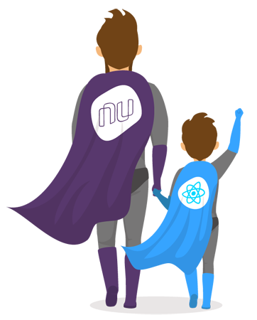

<p align="center">
  
</p>

# Nu's Mini-React

## Motivations

The motivation behind mini-react's is gettin' a job at my dream's company 💜 (kidding).

Mini-react is a library built to basically, test the skills of front-end candidates of nubank, and consists in building interfaces for front-end applications, it was inspired by our beloved [React](https://reactjs.org/).

> Before we begin, lets see the architecture of this application, and how it was built

For this, I decided to use a monorepo file structure so in case we need to evolve the application, we can use the folders and packages (inside packages folder) independently.

Mini-react have 3 main packages, 🔍 lets have a closer look:

## 📦 mini-react

The **_mini-react_** package concerns only components creation (Component class) and node parsing (Node) Needs to be used with a specific renderer (like _mini-react-dom_ for instance)

## 📦 mini-react-dom

This package serves as the entry point to the DOM and server renderers. It is intended to be paired with the generic mini-react package (☝️)

## 📦 mini-react-reconciler

When you use React, at a single point in time you can think of the render() function as creating a tree of React elements. On the next state or props update, that render() function will return a different tree of React elements. React then needs to figure out how to efficiently update the UI to match the most recent tree.

This is a very very simple implementation of React's new algorith known as Fiber, it was built based on the [Lin Clark's cartoon](https://www.youtube.com/watch?v=ZCuYPiUIONs) exponation, if you haven't seen yet, it's very cool and fun to watch! (Give her a 👍 after)

💡 Wanna hear something cool?
I built this last package (**_mini-react-reconciler_**) totally independent from the others, it doesnt need neither mini-react-dom, or mini-react to work, meaning that: if you like to add new renderers like **_mini-react-native_**, you can use this same package to reconcile your mobile application. Cool, right? Some crazy dependency injection going'on here.

## Contents

- [Installation](#installation)
- [Testing](#testing)
- [Usage](#usage)
- [Build](#build)

## Installation

First of all, you need to install the dependencies used to build the project

```sh
npm install
```

## Usage

Then, start the project

```js
npm run start
```

The default server address will be: http://localhost:10001

## Testing

npm start will run the tests already, but if you like to run only tests:

```js
npm run tests
```

## Build

**_mini-react_** uses [Rollup](https://www.youtube.com/watch?v=ZCuYPiUIONs) as build tool.

> Rollup was created for a different reason: to build flat distributables of JavaScript libraries as efficiently as possible, taking advantage of the ingenious design of ES2015 modules.
